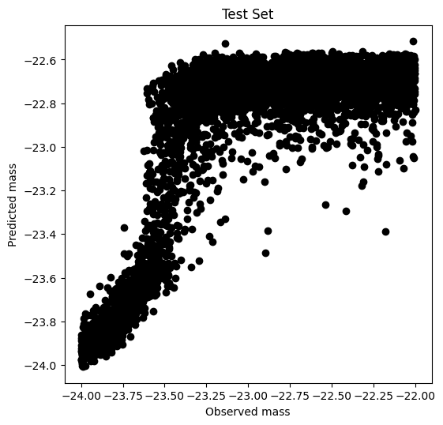
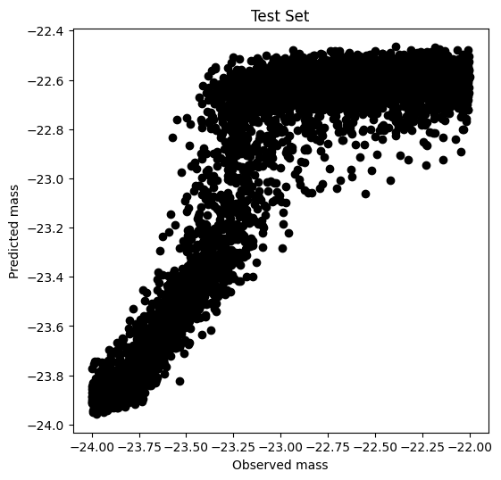
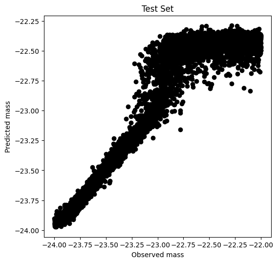

# GSoC2022-Deep-Regression

**Ongoing GSoC project, those are my experiments result.**

## Experiments

MAE on test set. Some result will be posted soon, I'm sorting them out.

|           NN Architecture            | Model I |  Model II   |  Model III   | Epoch |
| :----------------------------------: | :-----: | :---------: | :----------: | ----- |
|  ResNet34 (pretrained on ImageNet)   | 0.2849  |   0.2162    |    0.1332    | 300   |
|               Pure VIT               |         | 0.2741(8*8) | 0.2175 (8*8) | 300   |
|                CNN-T                 |         |             |    0.1459    | 300   |
| MobileNet V2 (pretrained on ImageNet |         |             |    0.1568    | 300   |
|                 CVT                  |         |             |              |       |

**Scatter plot on test set with ResNet34**

| Arch   |                   Model I                    |                   Model II                    |                   Model IIII                   |
| ------ | :------------------------------------------: | :-------------------------------------------: | :--------------------------------------------: |
| ResNet |  |  |  |
| Vit    |                                              |                                               |                                                |
|        |                                              |                                               |                                                |

**Model I**

**Model II**

**Model III**

## Citation

- **DeepLense**, (2021), <a href="https://github.com/ML4SCI/DeepLense">GitHub repository</a>.

- **Yurii's Post** <a href="https://medium.com/@yuriihalyc/gsoc-2021-with-ml4sci-deep-regression-for-exploring-dark-matter-32691c46adfa">link</a>.

- **ResNet34**

  Kaiming He, Xiangyu Zhang, Shaoqing Ren, and Jian Sun. Deep residual learning for image recognition. In Proceedings of the IEEE conference on computer vision and pattern recognition, pages 770–778, 2016.

- Pure VIT Code referenced from <a href="https://github.com/lucidrains/vit-pytorch/tree/main/vit_pytorch">vit-pytorch</a>.

- **CNN-T**

  Li, S.; Wu, C.; Xiong, N. Hybrid Architecture Based on CNN and Transformer for Strip Steel Surface Defect Classification. *Electronics* **2022**, *11*, 1200. https://doi.org/10.3390/electronics11081200

- **MobileNet V2** <a href="https://pytorch.org/vision/stable/models/generated/torchvision.models.mobilenet_v2.html#torchvision.models.mobilenet_v2">link</a>

- **CVT**

  Wu H, Xiao B, Codella N, et al. Cvt: Introducing convolutions to vision transformers[C]//Proceedings of the IEEE/CVF International Conference on Computer Vision. 2021: 22-31.